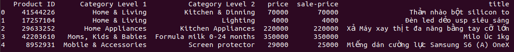

# This project aims to retrieve similar items given an item query (title).

## 1. Create virtual environment
```
conda env create -n shopping -f dockers/environment.yml
```
then activate it
```
conda activate shopping
```
and export some global environments:
```
export DATA_DIR='your directory containing data'
```

## 2. Data format (Pickle file)

in which Title, Product ID, Category Level 1, Category level 2 are prerequisite

## 3. How to train top2vec and index data
```
bash bin/train_top2vec.sh
```

```
bash bin/index_data.sh
```

## 4. How to start API (need trained Top2vec Model & Data Indexer)
Using port 8082
```
bash bin/api.sh 8082
```
After that you can request to the API using POST request:

Curl:
```
curl --location --request POST 'http://localhost:8082/v1.0/documents/search-by-text' \
--header 'Content-Type: application/json' \
--data-raw '{
    "title": "[free ship] sạc laptop asus[rẻ nhất 100k]"
}'
```
Python:
```
import requests
import json

url = "http://localhost:8082/v1.0/documents/search-by-text"

payload = json.dumps({
    "title": "[free ship] sạc laptop asus[rẻ nhất 100k]"
})
headers = {
    'Content-Type': 'application/json'
}

response = requests.request("POST", url, headers=headers, data=payload)
print(response.text)
```
